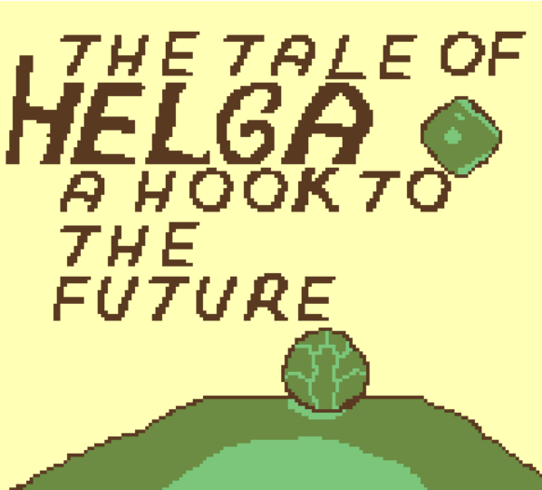
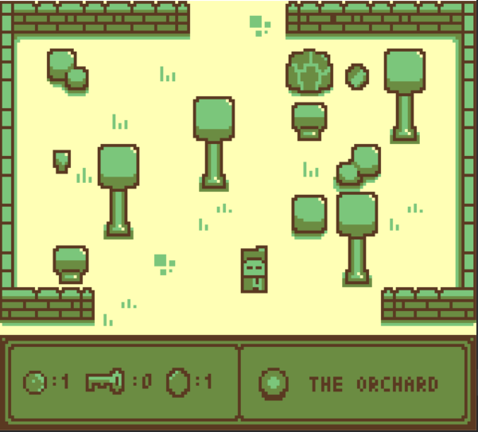
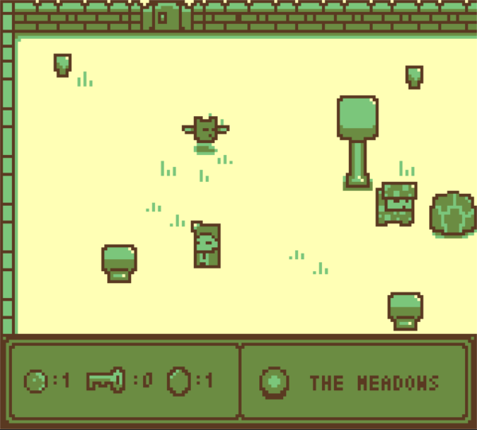

# The Tale of Helga



"The Tale of Helga: A Hook to the Future" is a thrilling adventure game where you play as Hook, a hero with a unique hooking tool,
who needs to free his beloved Helga from the hands of evil Hammond.

There are 10 space gems to collect along the way. Your Helga deserves the best space gifts so make sure you get them all!

Controls:

A/Z/J - Hook

B/X/K - Roll

DPAD/WSAD/ARROW KEYS - Move

Jam Theme: Space. So you move stuff around the world (or space...)

The game can be played on [itch.io](https://kamiljacek.itch.io/the-tale-of-helga-a-hook-to-the-future)




## Code

Built using [Pyxel](https://github.com/kitao/pyxel) engine. It's quite easy to use and I enjoyed playing with it. 

I completely missed on the "tilemap" feature so the way I created levels (from text arrays) is completely dumb and bugprone but hey, it works.

It's also crazy slow as I'm iterating over all objects over and over when checking for collisions. There are smarter ways to do it.

Pyxel requires you to use its own editor for graphics and sound. I tried using other libraries for playing sounds, so I could make music with another tool, but it doesn't work when packaging.

## Building

Create env using provided requirements.txt. I used python 3.8.10. 

You can run the game with:
```
pyxel run main.py
```

Edit assets with
```
pyxel edit assets/my_resource.pyxres
```

## License

Just do whatever you want with it.